# About

**ProSakart** is a language-learning application, specifically for vocabulary memorization. It is a portmanteau of *Professional* and *Sakartvelo*. Its source code is written in Python.

## License

Copyright © 2019  Elliot Paton-Simpson

This program is free software: you can redistribute it and/or modify
it under the terms of the GNU General Public License as published by
the Free Software Foundation, either version 3 of the License, or
(at your option) any later version.

This program is distributed in the hope that it will be useful,
but WITHOUT ANY WARRANTY; without even the implied warranty of
MERCHANTABILITY or FITNESS FOR A PARTICULAR PURPOSE.  See the
GNU General Public License for more details.

You should have received a copy of the GNU General Public License
along with this program.  If not, see <https://www.gnu.org/licenses/>.

# Installation

You will need Python3.6 (or a later version). There are no other packages required to install. It is batteries included.

To install ProSakart on Linux, use the following command:
```
$ sudo pip3 install git+https://github.com/clockback/prosakart
```

# Documentation

You may launch the application by typing:
```
$ prosakart
```
This will take you to the menu.

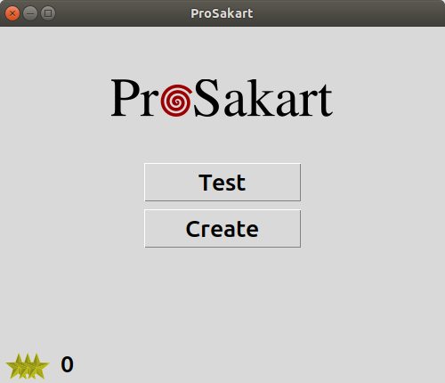

## Creating your vocabulary

ProSakart uses SQLite to manage a local database in your home folder under `.prosakart`. This means that, unless someone else gives you their own vocabulary sheets, you will have to populate your own database. The application provides the means to create your own vocabulary sheets.

### Defining languages

Before you can create your vocabulary, you will need to define some languages. For this example you will be using ProSakart to learn German. (Note that you can translate between languages other than English.) First, click on the "Create" button to access the "Create menu".

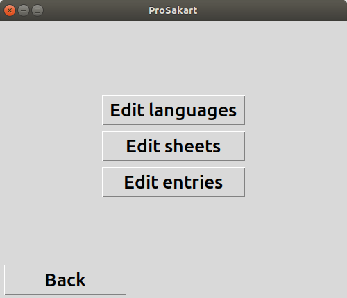

Here, we can either define languages, sheets, or vocabulary entries. To open the "Languages menu", click on the "Edit languages" button.

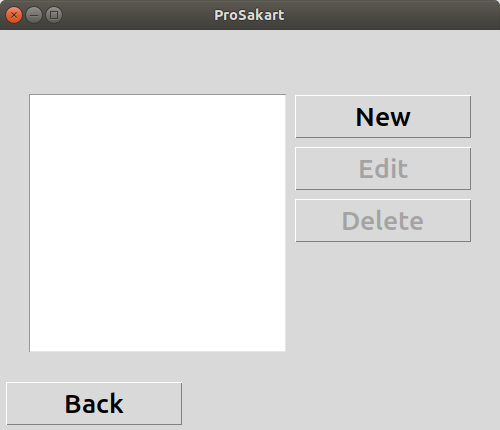

At the moment, there are no languages, so you will have to create your own. You can do this by clicking on the "New" button.

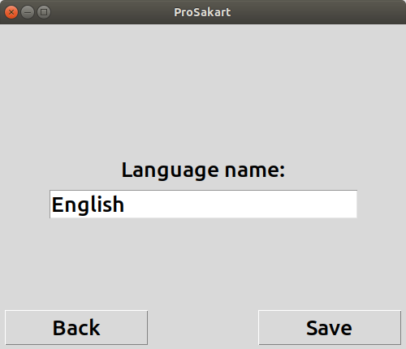

You will be prompted to give the language a name. For now, type "English" then click the "Save" button.

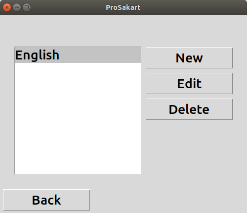

As you can see, English is now one of your languages. However, this application requires at least two languages to create vocabulary. Repeat the steps above to create another language: "German". Once this is done, click "Back" to return to the "Edit menu".

### Creating vocabulary entries

It is now time to create your own vocabulary entries. An entry consists of a question and corresponding allowable answers. For instance, if you want to memorize the German word "Vater" (meaning "father" in English), you will need an entry with "Vater" as its question and "father" as an answer. You could also have more than one answer, e.g. "dad". 

Click on the "Edit entries" to choose which languages you wish to create entries for.


Here, we can see two lists, each containing our two new languages. The first list is captioned "From:" and the second "To:". If we are trying to translate German into English, we must select "German" in the "From:" list and "English" in the "To:" list. You cannot create entries for the same language. Click on "Advance" to access the "Entries menu".

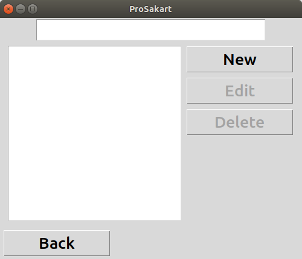

Ignore the search bar at the top. For now, it's useless, but once you start accumulating many entries, you may find it faster to filter them there rather than scrolling. Click on "New" to start creating your first entry.

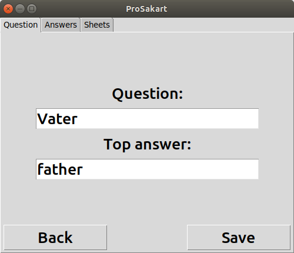

You will be able to fill in two forms. The first is the question, which you should populate with the word "Vater". The second is the top answer. This is the answer which is displayed during a test if the user answers the question incorrectly. Type in "father".

Before we save the entry, we may wish for the user to be able to answer the question with "dad" as well. To do so, click on the "Answers" tab at the top.

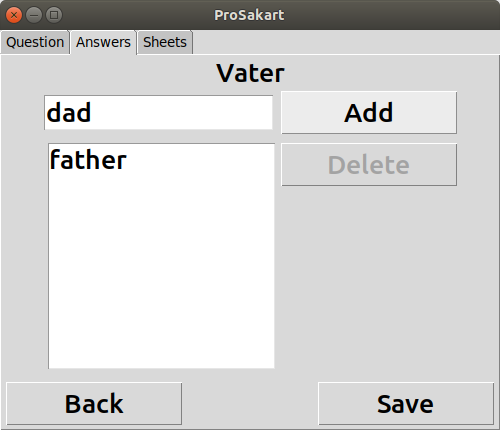

Here, we can see "father" in a list. To add another answer to the list, type in "dad" and click on the "Add" button. The word "dad" shall then be added to the bottom of the list.

You will want to add your answer to a sheet, but you haven't created any sheets yet, so you can ignore the "Sheets" tab at the top. Click "Save". You can now see your entry in the entries list. To have some more entries, populate add the following entries using the steps above:

| Question      | Top answer    | Extra answer  |
| ------------- | ------------- | ------------- |
| Mutter        | mother        | mum           |
| sein          | to be         |               |
| und           | and           |               |
| gut           | good          |               |
| spielen       | to play       |               |

Once this is completed, you should see the following in your entries list.

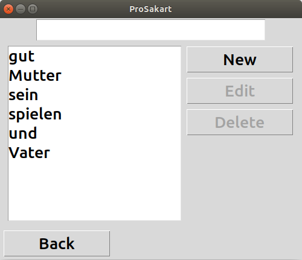

Once this is done, click "Back" twice to return to the "Edit menu".

### Creating vocabulary sheets

In order to test your vocabulary, you need to create vocabulary sheets. Click on the "Edit sheets" button.

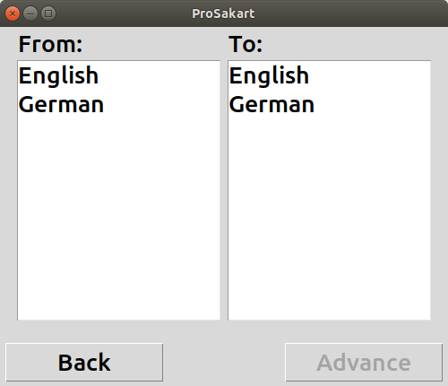

Like when you created the entries, you are prompted to select two languages. As before, select "German" and "English" respectively, then click "Advance" to access the "Sheets menu".

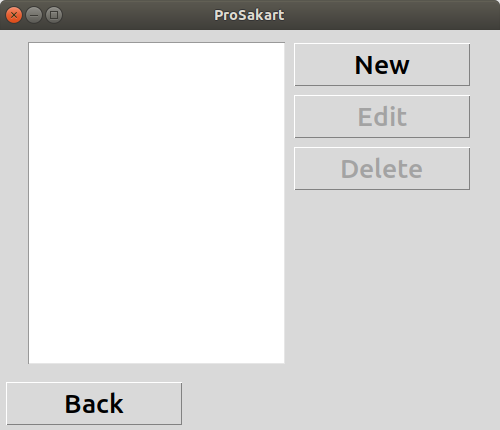

At the moment, you don't have any sheets. To create a new sheet, click "New".


You are prompted to give your sheet a name. Call your new sheet "Lesson 1 - Basics", but don't save the entry yet. Instead, click on the "Entries" tab at the top of the screen.

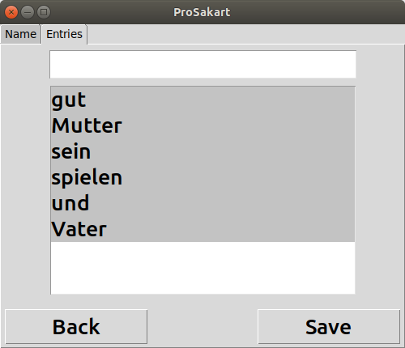

You will see a list of the entries that you've made. There is a search bar for when you have a very large number of entries. Select all six of the entries to add them to your sheet, such that they are all highlighted, then click on the "Save" button.

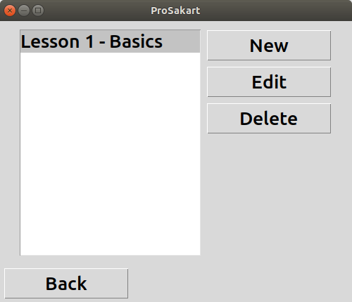

Looking at your sheets menu, you know have a single sheet. Now click "Back" three times to return to the menu.

Congratulations! You have created everything you need to start memorizing your vocabulary.

## Memorization with ProSakart

Now that everything is in place, it's time to click on the "Test" button, prompting you to select the languages you wish to test.

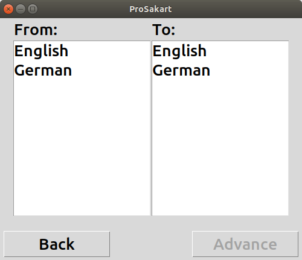

As usual, select "German" and "English" respectively, then click on "Advance".

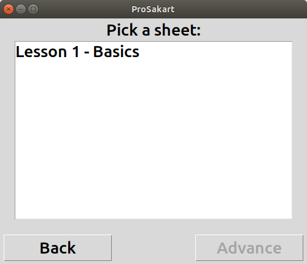

Select "Lesson 1 - Basics" and click "Advance".

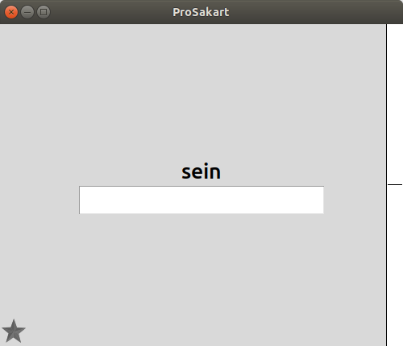

Finally, you are able to start memorizing your vocabulary. An entry will be randomly selected and given to you to answer. If you get it correct, a green bar will work its way up on the right-hand side of the screen. If you get it wrong, the bar will flood with red, displaying the correct answer. When this happens, hit the enter key once you have learned the correct answer to proceed with the next entry.

You must answer an entry at least two times correctly, but if you answer incorrectly, you will lose all your progress, and the number of consecutive correct answers required will increase. You will first need to work off your mistakes, until the bar is completely orange. Only once this is complete can you begin to reduce the number of bars on your screen. Upon reaching two bars once more, the bar will become green, signifying the entry's completion.

Once an entry is complete, a small yellow star shall appear in the bottom-left corner of the screen. This indicates how many points you have for that entry. You earn a star upon completing an entry, but can lose that star if you answer that question incorrectly again. If you have a star for long enough, the application will let you keep it permanently, providing you with the opportunity to obtain another star. This can be repeated for a maximum number of five stars (although the fifth can always be lost). The time you must wait between completing an entry and earning your next increases with each star.

| # star | Waiting period |
| ------ | -------------- |
|      2 | 1 day          |
|      3 | 1 week         |
|      4 | 1 month        |
|      5 | 3 months       |

Finally, you can see how many stars you have in total by going back to the main menu.


After completing the entries from this example, you should have six stars.

That's just about all there is. You can edit your languages, entries, and sheets as needed. You can also, while creating or editing individual sheets, add them to existing sheets. If you find any bugs in the software, please let me know on Github: <https://github.com/clockback/prosakart/issues>
